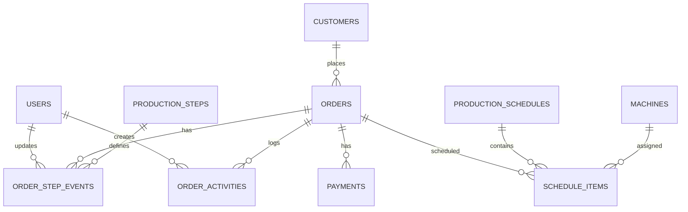

# Database Design

## 1. Database

Target: **PostgreSQL / Supabase**.

Prinsip:

- UUID untuk primary key internal.
- `spk_code` human-readable unique identifier.
- Jangan memindahkan order selesai ke tabel lain.
- Gunakan history tables untuk audit.
- Production step dibuat master-data agar flow dapat berkembang.

## 2. ERD



## 3. Enums

### user_role

```txt
superadmin
customer_service
designer
finance
production
supervisor
```

### order_priority

```txt
normal
urgent
```

### order_state

Jangan samakan `order_state` dengan production step.

```txt
active
on_hold
cancelled
completed
```

### step_state

```txt
pending
active
completed
blocked
skipped
```

### payment_status

```txt
not_invoiced
invoiced
dp
awaiting_payment
paid
cancelled
```

## 4. Table: profiles

Supabase `auth.users` menangani akun; data aplikasi berada di `profiles`.

```sql
create table profiles (
  id uuid primary key references auth.users(id) on delete cascade,
  full_name text not null,
  role text not null,
  is_active boolean not null default true,
  created_at timestamptz not null default now(),
  updated_at timestamptz not null default now()
);
```

## 5. Table: customers

```sql
create table customers (
  id uuid primary key default gen_random_uuid(),
  name text not null,
  phone text,
  normalized_phone text,
  address text,
  notes text,
  created_at timestamptz not null default now(),
  updated_at timestamptz not null default now()
);

create index idx_customers_name on customers using gin (to_tsvector('simple', name));
create index idx_customers_phone on customers(normalized_phone);
```

## 6. Table: orders

```sql
create table orders (
  id uuid primary key default gen_random_uuid(),
  spk_code text not null unique,
  external_transaction_code text,
  customer_id uuid references customers(id),

  production_type text not null, -- sublim / dtf / press
  paper_width_mm integer,        -- 1200 / 1600 / 1800
  meter numeric(10,2) not null default 0,

  priority text not null default 'normal',
  order_state text not null default 'active',
  current_step_id uuid,

  order_date date not null,
  due_at timestamptz,
  started_at timestamptz,
  completed_at timestamptz,

  notes text,
  source text default 'manual', -- manual / csv / whatsapp / integration
  created_by uuid references profiles(id),
  assigned_designer_id uuid references profiles(id),

  created_at timestamptz not null default now(),
  updated_at timestamptz not null default now()
);

create index idx_orders_spk on orders(spk_code);
create index idx_orders_due on orders(due_at);
create index idx_orders_state on orders(order_state);
create index idx_orders_current_step on orders(current_step_id);
create index idx_orders_paper_width on orders(paper_width_mm);
```

## 7. Table: production_steps

```sql
create table production_steps (
  id uuid primary key default gen_random_uuid(),
  code text not null unique,
  name text not null,
  sequence integer not null,
  is_active boolean not null default true,
  color_token text,
  created_at timestamptz not null default now()
);
```

Seed v1:

```txt
1 ORDER_IN      Order Masuk
2 DESIGN        Design
3 PRODUCTION    Printing & Press
4 COMPLETED     Selesai
```

Future seed tanpa mengubah desain database:

```txt
ORDER_IN → DESIGN → RIP → PRINTING → PRESS → QC → ADMINISTRATION → COMPLETED
```

## 8. Table: order_step_events

Menyimpan progress per order dan timestamps.

```sql
create table order_step_events (
  id uuid primary key default gen_random_uuid(),
  order_id uuid not null references orders(id) on delete cascade,
  step_id uuid not null references production_steps(id),
  state text not null default 'pending',
  started_at timestamptz,
  completed_at timestamptz,
  note text,
  updated_by uuid references profiles(id),
  created_at timestamptz not null default now(),
  updated_at timestamptz not null default now(),
  unique(order_id, step_id)
);
```

## 9. Table: order_activities

Immutable activity stream.

```sql
create table order_activities (
  id bigint generated always as identity primary key,
  order_id uuid not null references orders(id) on delete cascade,
  event_type text not null,
  message text not null,
  actor_id uuid references profiles(id),
  metadata jsonb not null default '{}'::jsonb,
  created_at timestamptz not null default now()
);

create index idx_activity_order_time on order_activities(order_id, created_at desc);
```

## 10. Table: invoices

```sql
create table invoices (
  id uuid primary key default gen_random_uuid(),
  order_id uuid not null unique references orders(id),
  invoice_number text unique,
  total_amount numeric(14,2),
  status text not null default 'not_invoiced',
  issued_at timestamptz,
  due_at timestamptz,
  created_by uuid references profiles(id),
  created_at timestamptz not null default now(),
  updated_at timestamptz not null default now()
);
```

## 11. Table: payments

```sql
create table payments (
  id uuid primary key default gen_random_uuid(),
  order_id uuid not null references orders(id),
  invoice_id uuid references invoices(id),
  amount numeric(14,2) not null,
  payment_method text,
  reference text,
  paid_at timestamptz not null,
  created_by uuid references profiles(id),
  created_at timestamptz not null default now()
);
```

## 12. Table: machines

```sql
create table machines (
  id uuid primary key default gen_random_uuid(),
  code text not null unique,
  name text not null,
  production_type text,
  is_active boolean not null default true,
  speed_meter_per_hour numeric(10,2),
  created_at timestamptz not null default now()
);
```

## 13. Table: production_schedules

```sql
create table production_schedules (
  id uuid primary key default gen_random_uuid(),
  schedule_date date not null,
  status text not null default 'draft', -- draft/approved/in_progress/completed
  generated_by uuid references profiles(id),
  approved_by uuid references profiles(id),
  generated_at timestamptz not null default now(),
  approved_at timestamptz,
  algorithm_version text,
  notes text
);
```

## 14. Table: schedule_items

```sql
create table schedule_items (
  id uuid primary key default gen_random_uuid(),
  schedule_id uuid not null references production_schedules(id) on delete cascade,
  order_id uuid not null references orders(id),
  machine_id uuid references machines(id),
  sequence integer not null,
  planned_start timestamptz,
  planned_end timestamptz,
  setup_minutes integer not null default 0,
  reason text,
  is_manual_override boolean not null default false,
  unique(schedule_id, order_id)
);
```

## 15. Recommended views

### order_overview

Gabungkan order + customer + step + invoice status untuk dashboard.

### overdue_orders

```sql
where order_state = 'active'
  and due_at < now()
```

### completed_today

```sql
where order_state = 'completed'
  and completed_at::date = current_date
```

## 16. Data deletion

- Order normal: **soft state**, jangan delete dari UI.
- Cancel order: `order_state = cancelled`.
- Hard delete hanya superadmin dan untuk data salah/test.
- Activity log tidak boleh diedit user biasa.
