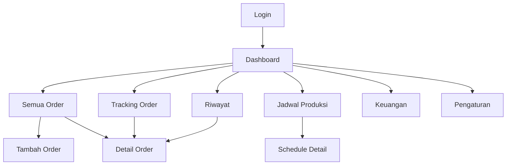
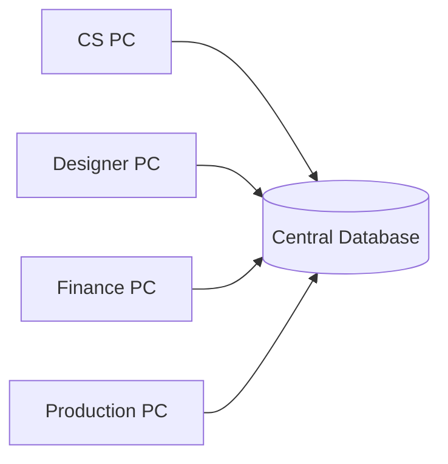

# Information Architecture

## Sitemap



## Route recommendation

```txt
/login
/dashboard
/orders
/orders/new
/orders/[id]
/tracking
/schedule
/history
/finance
/settings
```

Optional future routes:

```txt
/customers
/machines
/reports
/integrations/whatsapp
```

## Navigation rules

- Semua role dapat membuka Dashboard dan Tracking.
- Menu/action yang tidak diizinkan harus disembunyikan atau disabled berdasarkan permission.
- Direct URL tetap dilindungi server-side authorization.

## Data ownership

Tidak ada “database CS”, “database designer”, atau “database keuangan” terpisah.

Semua role membaca sumber data yang sama:


