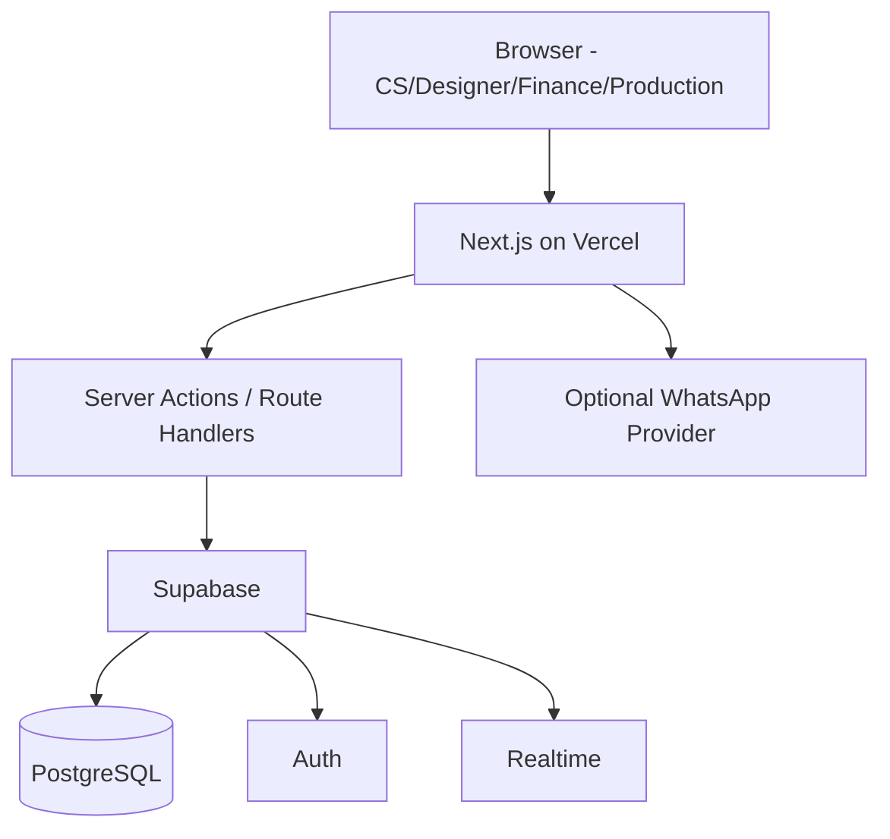

# Technical Architecture

## 1. Prototype vs production

### Prototype Figma

```txt
React + Vite + Tailwind
Local in-memory state
Hard-coded orders
No auth
No database
No realtime persistence
```

### Production target



## 2. Suggested project structure

```txt
src/
  app/
    (auth)/
      login/page.tsx
    (dashboard)/
      layout.tsx
      dashboard/page.tsx
      orders/page.tsx
      orders/[id]/page.tsx
      tracking/page.tsx
      schedule/page.tsx
      history/page.tsx
      finance/page.tsx
      settings/page.tsx
    api/
  components/
    layout/
    orders/
    tracking/
    schedule/
    finance/
    ui/
  lib/
    supabase/
    auth/
    permissions/
    validation/
    scheduling/
    formatters/
  types/
  hooks/
```

## 3. State management

Server state:

- database is source of truth
- use server fetch / query library if needed
- realtime invalidates current data

Local state only for:

- modal open/closed
- filter UI
- selected row
- temporary form state

Jangan menyimpan daftar order utama hanya dalam `useState` seperti prototype.

## 4. Validation

Gunakan shared schema validation (mis. Zod) pada:

- frontend form
- server action/API

Database tetap memiliki constraints.

## 5. Date/time

Business timezone: **Asia/Jakarta**.

Database timestamps: `timestamptz`.

Display: WIB.

Jangan menyimpan due time sebagai string seperti `"Hari ini 17:00"`; itu derived UI value.

## 6. Search

MVP:

- SPK exact/prefix
- customer case-insensitive
- normalized phone

Scale-up:

- PostgreSQL trigram/full-text index

## 7. Error boundaries

Setiap page kritikal memiliki:

- loading
- error state
- empty state
- retry

## 8. Environment variables

```txt
NEXT_PUBLIC_SUPABASE_URL=
NEXT_PUBLIC_SUPABASE_ANON_KEY=
SUPABASE_SERVICE_ROLE_KEY=   # server only, bila benar-benar diperlukan
APP_URL=
```

Secret tidak pernah `NEXT_PUBLIC_`.
