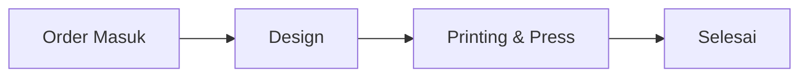

# UI / UX Specification

## 1. Prinsip UX utama

**Search-first dashboard.** Tujuan utama layar adalah menemukan informasi order dengan cepat, bukan melihat banyak grafik.

## 2. Sidebar

Urutan menu production:

1. Dashboard
2. Semua Order
3. Tambah Order
4. Tracking Order
5. Jadwal Produksi
6. Riwayat
7. Keuangan
8. Pengaturan

> Menu Keuangan wajib ditambahkan pada website production walaupun prototype aktif terakhir belum menampilkannya.

## 3. Header

Elemen:

- `Printex Order Monitoring Dashboard`
- Subtitle sesuai role/context
- Notification bell
- User avatar/name
- Role aktif
- Logout melalui profile menu

## 4. Dashboard

### KPI cards

- Order Baru
- Sedang Diproses
- Selesai Hari Ini
- Terlambat

Definisi:

```txt
Order Baru       = order pada tahap awal dan belum dikerjakan
Sedang Diproses  = order aktif setelah tahap awal dan belum selesai
Selesai Hari Ini = completed_at berada pada hari berjalan
Terlambat        = due_at < now AND belum selesai
```

### Search utama

Placeholder:

`Cari SPK / Nama Customer / No. WhatsApp...`

Search harus:

- case-insensitive untuk SPK/customer
- normalisasi nomor WhatsApp
- debounce 250–400 ms
- bisa mencari order aktif dan selesai

### Filter

Baseline Figma:

- Semua
- Design
- Printing & Press
- Selesai
- Terlambat

Filter production harus data-driven dari `production_steps`, sehingga bisa berkembang menjadi RIP, Printing, Press, QC, Administrasi tanpa rewrite UI.

## 5. Tabel order

Kolom minimal:

| Kolom | Keterangan |
|---|---|
| Kode SPK | unique order number |
| Customer | nama + WA kecil di bawah |
| Proses Sekarang | current production step |
| Jenis | Sublim/DTF/Press |
| Lebar | 1,2 / 1,6 / 1,8 m |
| Meter | quantity meter |
| Status | status badge |
| Due Date | due date/delay |
| Action | detail |

Row dapat diklik untuk membuka tracking/detail.

## 6. Detail order

Informasi:

- SPK
- Customer
- WhatsApp
- Jenis produksi
- Lebar kertas
- Meter
- Tanggal order
- Due date
- Priority
- Catatan
- Status saat ini

Action hanya muncul jika user memiliki permission.

## 7. Tracking produksi

Baseline v1:



Website production harus memakai master step, bukan array hard-coded.

Setiap step memiliki:

- state: pending / active / completed / skipped / blocked
- started_at
- completed_at
- updated_by
- optional note

## 8. Activity log

Format:

```txt
13:24  Printing & Press dimulai   Operator Produksi
11:14  Design disetujui customer CS 1
10:53  Design dikirim ke customer Designer 1
```

Tampilkan aktivitas terbaru terlebih dahulu.

## 9. Tambah Order

Field sesuai Figma + kebutuhan production:

| Field | Wajib? |
|---|---|
| Customer | Ya |
| Nomor WhatsApp | Disarankan |
| Jenis Produksi | Ya |
| Ukuran Kertas | Ya untuk proses terkait |
| Jumlah Meter | Ya |
| Tanggal Order | Ya |
| Due Date | Ya |
| Priority | Ya |
| Catatan | Tidak |

Production addition:

- referensi/kode transaksi sumber
- sales/CS owner
- file/link desain jika tersedia
- status awal

## 10. Tracking Order page

Layout:

```txt
[ Search full width ]

[ Detail & Timeline                     ][ Semua Order Aktif ]
[ Activity                              ][                  ]
```

Search result maksimal 5 suggestion, lalu detail dapat dipilih.

## 11. Jadwal Produksi

Kolom:

- sequence
- SPK
- customer
- paper width
- meter
- priority
- due date
- status

Tambahkan separator visual saat ukuran kertas berubah:

`Setup ganti ukuran kertas → 1,6 m`

## 12. Riwayat

- hanya order completed
- searchable
- filter tanggal/customer/jenis
- klik row membuka detail read-only

## 13. Keuangan

Tambahkan halaman production:

- SPK
- customer
- invoice status
- amount
- payment status
- paid amount
- due payment
- payment date

Status minimum:

`Belum Invoice → Invoice Dibuat → DP → Menunggu Pelunasan → Lunas`

Status keuangan **terpisah** dari status produksi.
