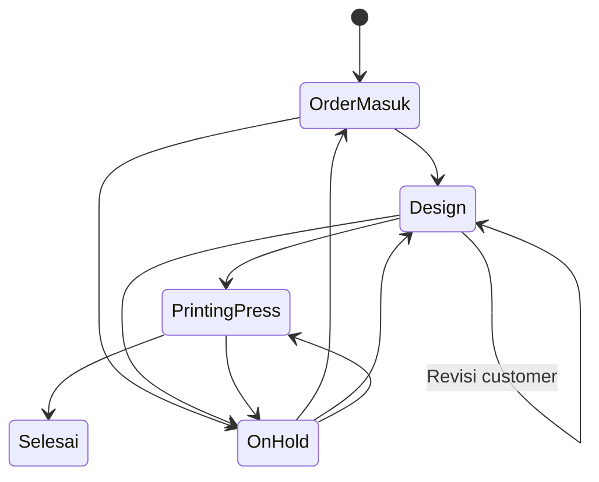

# Workflow & Business Rules

## 1. Order lifecycle v1

## 2. Separation of concerns

### Production progress

Menunjukkan proses fisik/order:

`Order Masuk → Design → Printing & Press → Selesai`

### Order state

Menunjukkan kondisi global:

- active
- on_hold
- cancelled
- completed

### Financial state

Terpisah:

- not_invoiced
- invoiced
- dp
- awaiting_payment
- paid

Order bisa **produksi selesai tetapi belum lunas**.

## 3. Business rule: due date

`overdue = now > due_at AND order_state != completed/cancelled`

Status terlambat sebaiknya dihitung, bukan disimpan sebagai satu-satunya status permanen.

## 4. Business rule: progress

Saat user menekan `Lanjutkan ke tahap berikutnya`:

1. Check permission.
2. Validasi order belum completed/cancelled.
3. Complete current step.
4. Activate next step.
5. Update `orders.current_step_id`.
6. Jika next step = Selesai:
   - `order_state = completed`
   - `completed_at = now()`
7. Insert activity log.
8. Publish realtime update.

Semua dilakukan dalam satu transaction/server function.

## 5. Design revision

Revisi customer tidak sebaiknya menjadi production step permanen.

Gunakan:

- current step tetap `DESIGN`
- `step_state = blocked` atau metadata `design_status = revision_requested`
- activity log mencatat revisi

## 6. Order creation

Saat order dibuat:

1. Find/create customer berdasarkan normalized phone + nama.
2. Generate SPK code atau gunakan kode resmi dari sistem sumber.
3. Insert order.
4. Initialize semua step events.
5. Step pertama active, lainnya pending.
6. Insert activity `ORDER_CREATED`.

## 7. Editing

Data yang bisa berubah sebelum produksi:

- customer
- phone
- due date
- paper width
- meter
- priority
- notes

Perubahan yang mempengaruhi scheduler harus menginvalidate draft schedule atau memberi warning.

## 8. Completion

Order selesai:

- tidak dihapus
- tampil di Riwayat
- tetap searchable
- detail menjadi read-only bagi role non-supervisor, kecuali financial fields yang belum selesai

## 9. Cancel / hold

Cancel membutuhkan:

- reason
- actor
- timestamp

Hold membutuhkan:

- reason
- optional resume_at

## 10. Manual override scheduler

Supervisor/operator dapat mengubah urutan rekomendasi.

Simpan:

- original generated sequence
- final sequence
- actor
- reason optional
- `is_manual_override = true`
